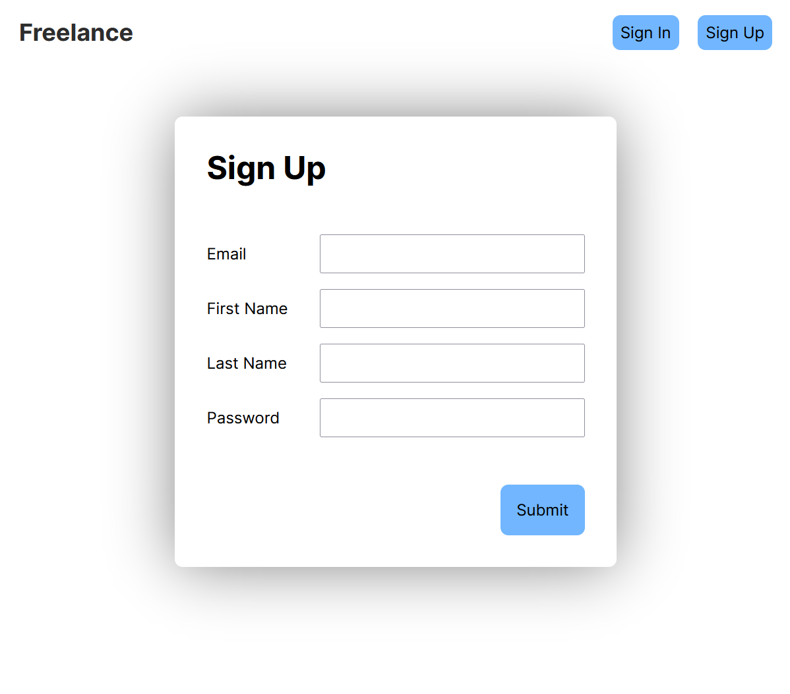

# Freelance

Rust based api with Axum, Mongo for the database, React-Vite for the front-end, and AWS and docker compose for hosting. Uses full authentication with JWT tokens and cookies for session management.

## Environment Variables

MONGODB_URI - URI for MongoDB server
JWT_SECRET - Secret for JWT tokens to use for verification
PORT - Port for the server to be hosted on
COOKIE_DOMAIN - Domain for cookies

## Licence

MIT
